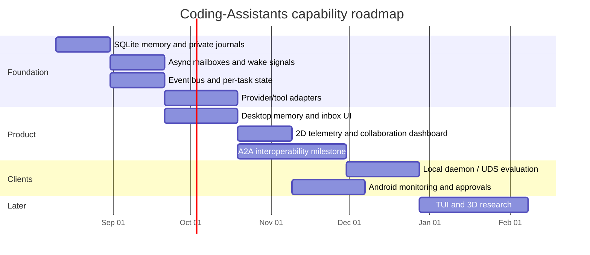

# Coding-Assistants Roadmap

> **Version:** 2.0
> **Date:** 2026-08-10
> **Product:** local-first collaboration hub for a human developer and
> external AI agents.

This is the canonical implementation-order index. Detailed work is organized
by capability rather than programming language. Research remains under
[`research/`](research/) and [`reports/`](reports/).

## Priority order

1. Memory and private journals
2. Communication and asynchronous coordination
3. Platform reliability, providers, tools, and security
4. Desktop UI and 2D dashboard
5. A2A interoperability (next major milestone)
6. Daemon/multi-client extraction when justified by a second client
7. Android monitoring and approval
8. Someday/research: TUI, 3D visualization, GraphQL, actor frameworks

The dates are sequencing placeholders, not delivery promises. Each capability
roadmap must add acceptance criteria at least every few entries.

## Capability roadmaps

| Capability | Roadmap | Priority |
| --- | --- | --- |
| Memory and private journals | [`roadmaps/memory.md`](roadmaps/memory.md) | P0 |
| Communication and delegation | [`roadmaps/communication.md`](roadmaps/communication.md) | P0 |
| Platform/providers/tools/security | [`roadmaps/platform.md`](roadmaps/platform.md) | P1 |
| Desktop/mobile/TUI UI | [`roadmaps/ui.md`](roadmaps/ui.md) | P1/P3 |
| Telemetry and dashboards | [`roadmaps/dashboard.md`](roadmaps/dashboard.md) | P1 |
| Infrastructure and documentation | [`roadmaps/infrastructure.md`](roadmaps/infrastructure.md) | P1 |

## Product gates

- **Memory gate:** two agents retrieve and correctly use a prior handoff on a
  real repository task; shared and private records remain separated.
- **Coordination gate:** asynchronous wired workflows survive agent absence,
  wake according to policy, and preserve an auditable transcript.
- **A2A gate:** a compatible external agent can be discovered and delegated a
  bounded task without bypassing identity, approval, budget, or audit policy.
- **V1 gate:** the owner and multiple agents complete a meaningful task on a
  repository such as Project-Mobile-Fortress with quality matching or exceeding
  a single contributor.

LAN TCP remains available during early development. Authentication and TLS are
  later platform work. Firebase is retained for cloud/device synchronization
  prototypes; other unused deployment scaffolding is removed.
